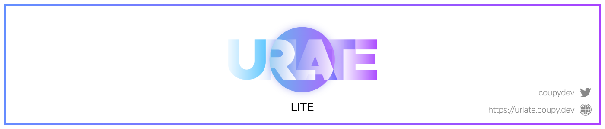

## URLATE-v3l-frontend

> Avoid & Get on the tempo, URLATE.

본 리포지토리는 [URLATE-v3-frontend](https://github.com/team-croissant/urlate-v3-frontend)의 복사본을 기반으로 개발되었습니다.  
과거 커밋 기록들은 모두 삭제되었으며, 필요한 경우 원본 리포지토리를 참고하시길 바랍니다.

## 개요

URLATE는 2019년부터 개발되어 2020년에 첫 데모버전을 공개, [텀블벅](https://tumblbug.com/urlate)에서 크라우드 펀딩을 진행하였습니다.  
[한국음악저작권협회](https://www.komca.or.kr/CTLJSP), [한국음악실연자협회](https://www.fkmp.kr)와 계약하고 음악 프로듀서 분들과 개인 계약을 맺는 등 체계적이고 합법적인 음악 이용권 준수를 위해 노력했습니다.  
펀딩 이후 2번에 걸친 Closed Beta Test를 통해 유저들의 피드백을 반영하고 2021년 11월 11일에 정식 출시되었으나, 부실했던 BM과 운영, 팀 내부 균열 등으로 인해 2022년 1월에 서비스를 종료하였습니다.

**URLATE-v3l**은 2021년 출시되었던 상업용 게임 URLATE의 v3버전을 기반으로 오픈소스 게임을 제작 및 배포하는 프로젝트입니다.  
본 프로젝트는 URLATE-v3을 수정하여 URLATE-v3을 제대로 동작하는 아카이브로 남겨두는 것에 의미가 있습니다.

## v3과 v3l의 차이

URLATE-v3l은 프로젝트로 수익을 창출할 의도가 없습니다.  
따라서, 기존 v3에 존재하던 스토어, 멤버십 등 수익창출 요소를 모두 제거하여 오직 게임의 데모목적만 수행할 수 있도록 수정되었습니다.

## QnA

### 이 프로젝트는 어디서 구동되고있나요?

[여기](https://urlate.coupy.dev/)에서 URLATE를 직접 플레이 해볼 수 있습니다.

### URLATE를 수정/사용/배포해도 될까요?

URLATE-v3l은 CC BY-NC-SA 4.0를 따르고 있습니다. CC BY-NC-SA 4.0의 내용은 다음과 같습니다.

- 가능
  - 복제
  - 전시
  - 수정
  - 배포
  - 개인적 이용
  - 공연 및 공중송신
- 제약
  - 상업적(영리적) 이용 금지
  - 법적 책임 없음
  - 보증하지 않음
  - 추가제한금지
- 조건
  - 동일조건변경허락
  - 저작자표시

게임의 모든 리소스는 CC BY-NC-ND 4.0를 따릅니다.
