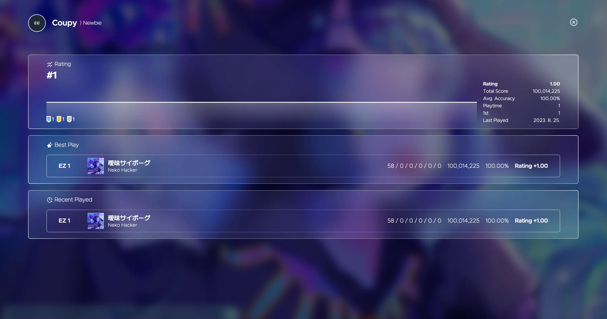
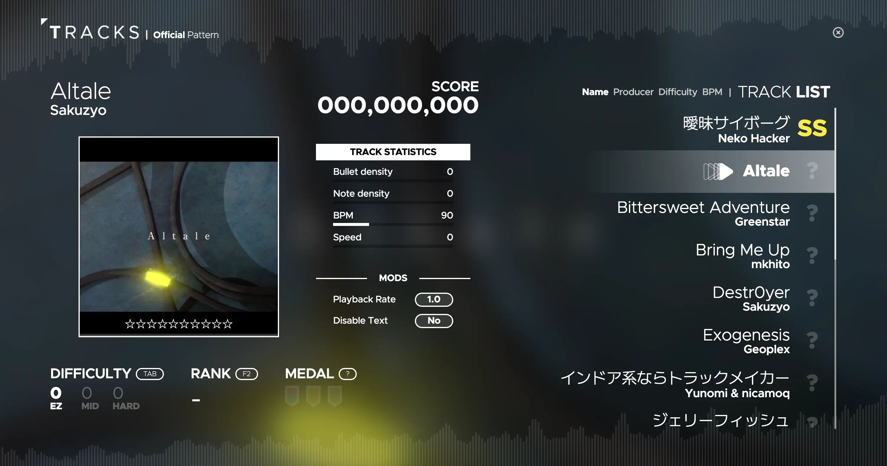

# Avoid & Get on the tempo, URLATE.

URLATE is a open-source rhythm game built with web technologies.  
It does not support Safari, but it is compatible with Firefox and Blink based browsers such as Chrome, Edge, and Opera.

This repository is based on [URLATE-v3-frontend](https://github.com/Team-Croissant/URLATE-v3-frontend), and is a new version of URLATE with a new UI and new features.  
If you need to refer to the past commit history, please refer to the repository above.

## Table of Contents

- [Try it out](#try-it-out)
- [How to play](#how-to-play)
- [Screenshots](#screenshots)
- [To-do](#to-do)
- [Documentation](#documentation)
- [License](#license)
- [Tumblbug supporters](#tumblbug-supporters)
- [Support](#support)

## Try it out

You can play the latest version of URLATE at [urlate.coupy.dev](https://urlate.coupy.dev/).  
There's an development version of URLATE at [dev.urlate.coupy.dev](https://dev.urlate.coupy.dev/), but it's not recommended to play it because it's not stable, and it may not be playable.

## How to play

## Screenshots

### Home

### Profile

### Song Select

### Gameplay

### Result

### Settings

### Editor

## To-do

The to-do list of URLATE is managed in [GitHub Projects](https://github.com/users/HyeokjinKang/projects/3).

## Documentation

If you want to know the internal structure of URLATE, or if you are interested in developing new features, creating external extensions, etc., you can refer to the [official document](https://mirai.urlate.coupy.dev/docs).

## License

URLATE-v3l is licensed under the AGPLv3 license.  
Detailed information about the license can be found [here](https://choosealicense.com/licenses/agpl-3.0/).

**If you want to use the source code of this repository for commercial purposes, please contact me via [email](mailto:urlate@coupy.dev).**

Note that the license only applies to the source code of this repository, and does not apply to the assets used in the game.  
Brand "URLATE" and its logo are credited to Coupyworks.

Copyright informations can be found [here](https://urlate.coupy.dev/info).

## Tumblbug supporters

[URLATE, 웹에서 즐기는 리듬게임](https://tumblbug.com/urlate)

Thank you to everyone who sponsored through Tumblbug.  
Tumblbug supporters will be rewarded with a special badge in the game.

## Support

